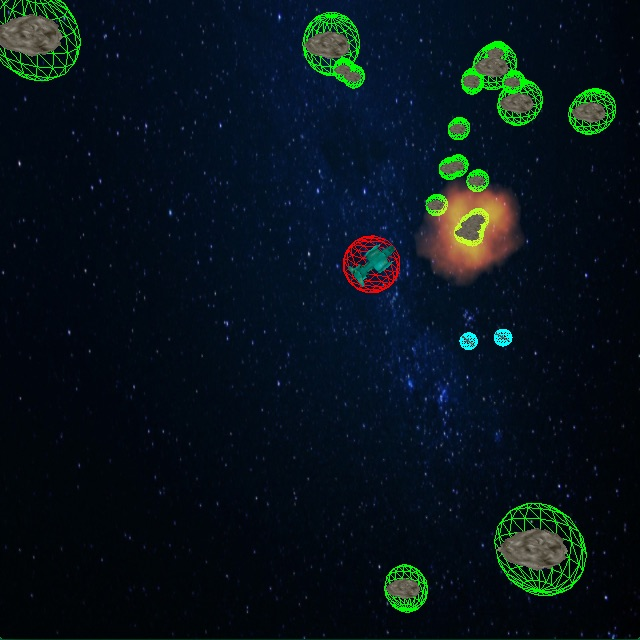

# LambdaCube 3D Workshop

To prepare for the workshop read the following steps

## Requirements
- Hardware support for OpenGL 3.3 or better
- OS: Linux/OSX/Windows

## Setup Development Environment
1. Install Haskell [Stack](http://www.haskellstack.org) by following it's simple [install manual](https://docs.haskellstack.org/en/stable/README/#how-to-install).
2. On **Linux** install the following libraries.
   i.e. on Ubuntu:
   ```
   sudo apt install libgl1-mesa-dev libxi-dev libxcursor-dev libxinerama-dev libxrandr-dev zlib1g-dev
   ```
   For other Linux distributions make sure the corresponing packages are installed.
   
   *These libraries required for OpenGL development.*

## Run the sample project

Checkout the this repository then run the following commands to check your setup.
```
cd hello
stack setup
stack build
stack exec hello
```
On success you should see this.


## Slides
[lc-workshop.html](https://rawgit.com/csabahruska/lambdacube-workshop/master/lc-workshop.html)

## Run asteroids

```
cd asteroids
stack build
stack exec asteroids
```



